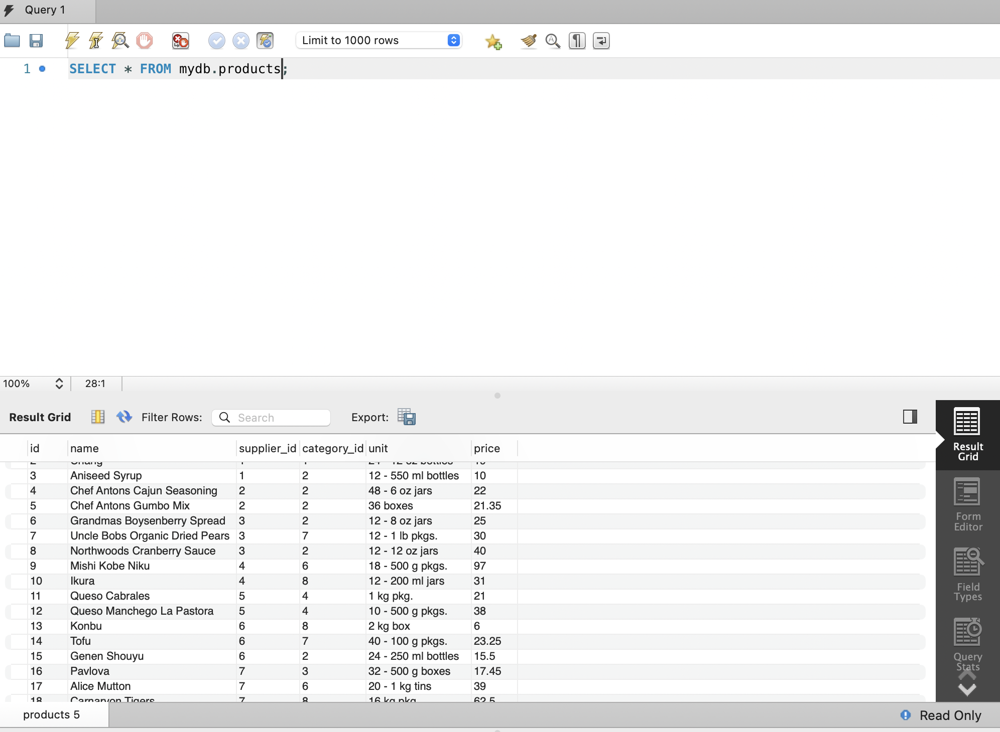
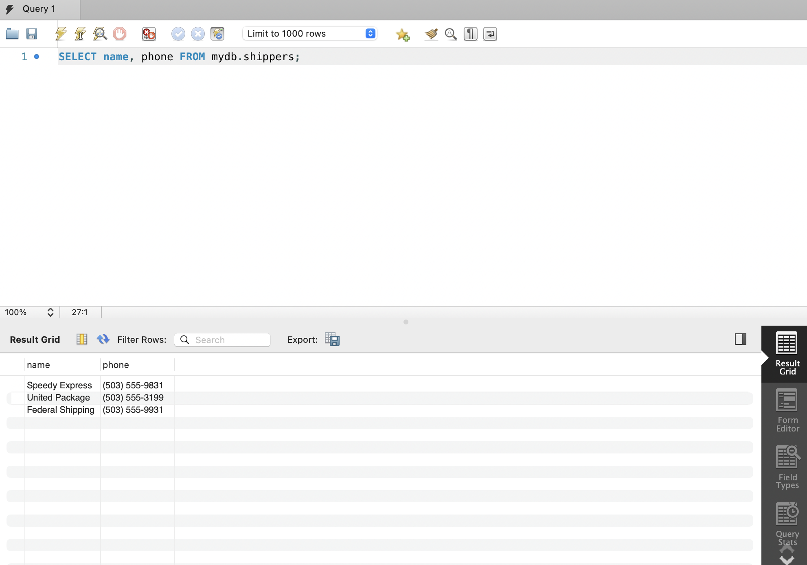
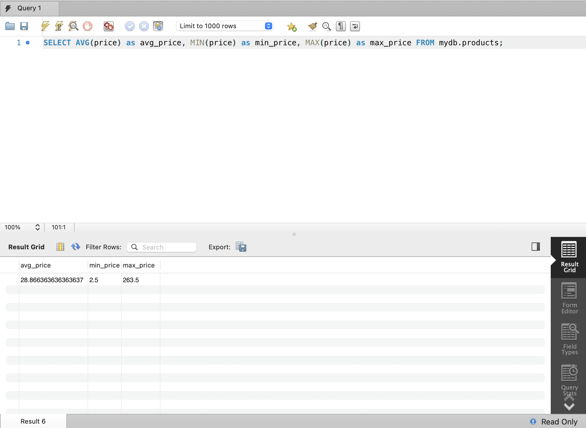
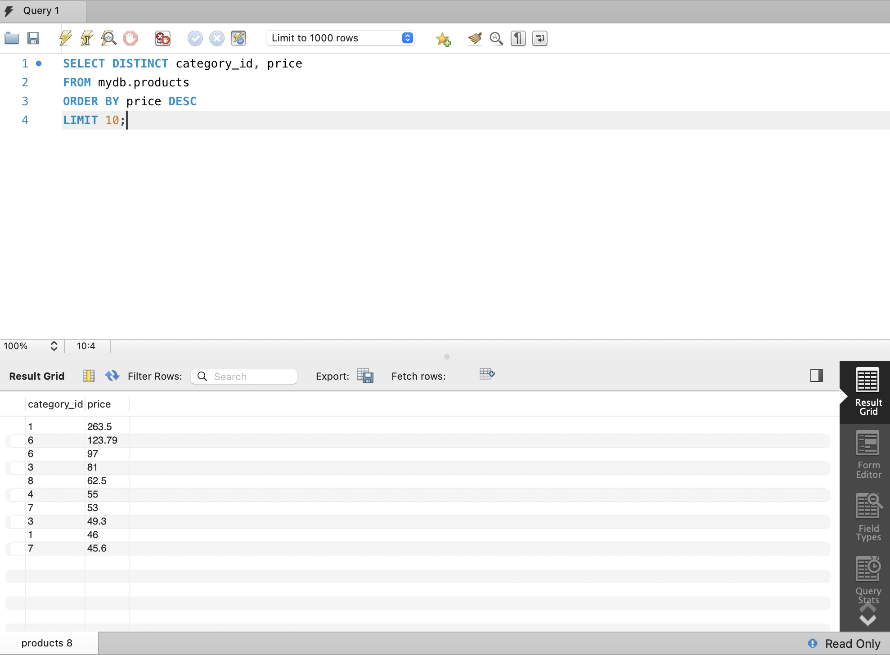
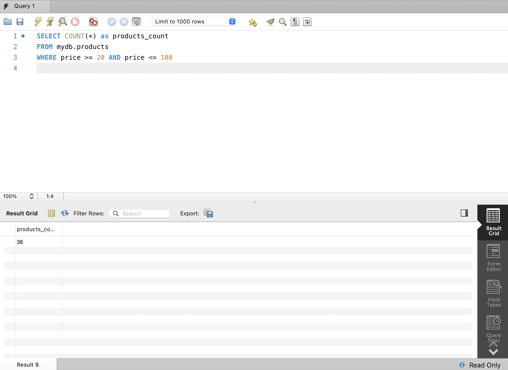
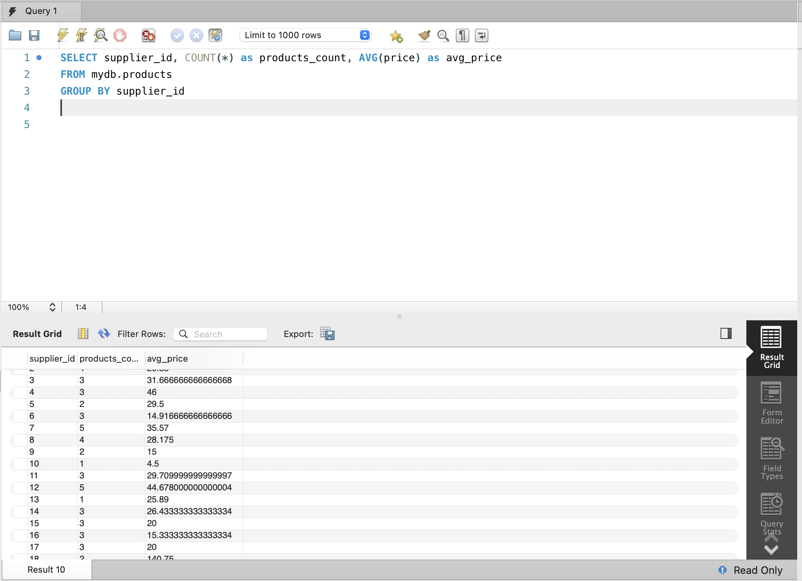

# Домашнє завдання до Теми 3. Завантаження даних та основи SQL. DQL команди

## 1.1. Вибрати всі стовпчики (За допомогою wildcard “\*”) з таблиці “products”;

```js
SELECT \* FROM `mydb`.`products`;
```



## 1.2. Вибрати тільки стовпчики name, phone з таблиці shippers

```js
SELECT `shippers`.`name`, `shippers`.`phone` FROM `mydb`.`shippers`;
```



## 2. Напишіть SQL команду, за допомогою якої можна знайти середнє, максимальне та мінімальне значення стовпчика price таблички products

```js
SELECT AVG(price) as avg_price, MIN(price) as min_price, MAX(price) as max_price FROM mydb.products;
```



## 3. Напишіть SQL команду, за допомогою якої можна обрати унікальні значення колонок category_id та price. Оберіть порядок виведення на екран за спаданням значення price та виберіть тільки 10 рядків

```js
SELECT DISTRINCT category_id, price
FROM mydb.products
ORDER BY price DESC
LIMIT 10;
```



## 4. Напишіть SQL команду, за допомогою якої можна знайти кількість продуктів (рядків), які знаходиться в цінових межах від 20 до 100

```js
SELECT COUNT(*) as products_count
FROM mydb.products
WHERE price >= 20 AND price <= 100
```



## 5. Напишіть SQL команду, за допомогою якої можна знайти кількість продуктів (рядків) та середню ціну (price) у кожного постачальника (supplier_id)

```js
SELECT supplier_id, COUNT(*) as products_count, AVG(price) as avg_price
FROM mydb.products
GROUP BY supplier_id
```


